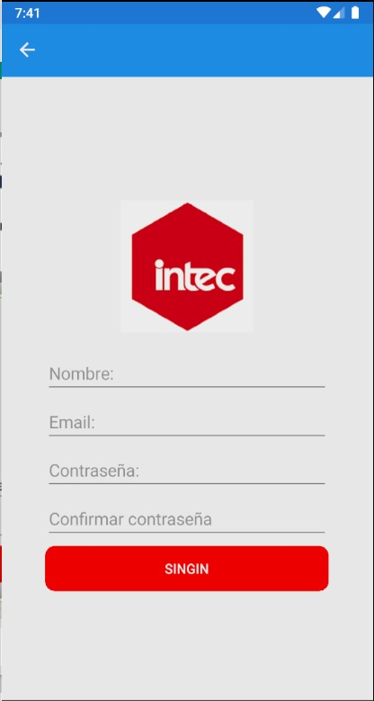
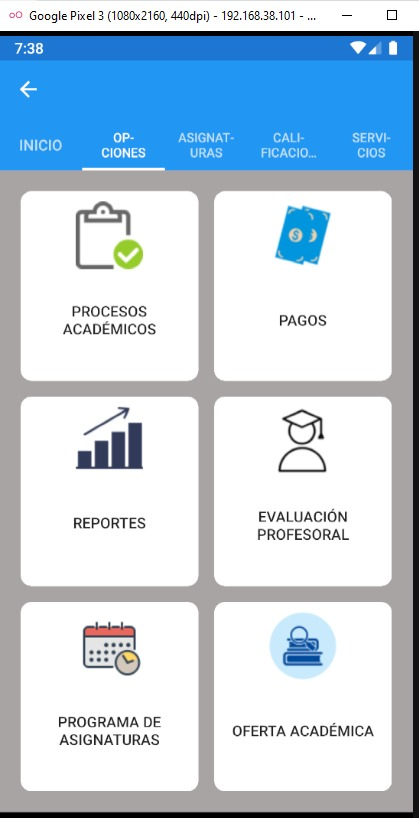

# MVVMFirstProject
Re-creating the log in example with MVVM and adding a new Home Page

When you open the app, you will see the log in page.

This page have the same logic as the previous project. Now, I added some styling to the log in button and a register page.

When you complete all the entries it will send you back to log in. If any of the entries are empty or both password doesn't macth it will show you an alert.

Back in the log in, if you click the main button you will go now to the home page. This is a tabbed page, where the second one have some buttons made with grid. I also added some images on top of the text to make it more interesting.

